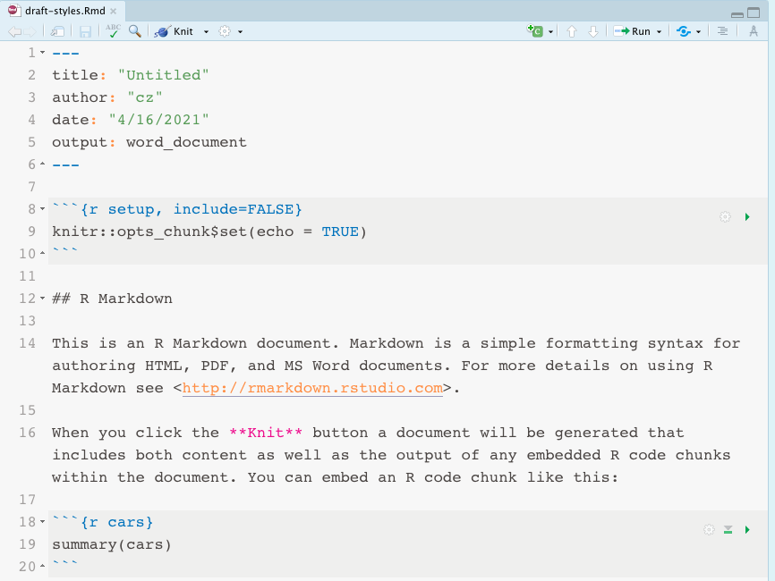

# Rmd to docx

https://rmarkdown.rstudio.com/articles_docx.html

# Step 1. Create style

## reference docx (created by R markdown)

#### in Rstudio 

1. create an `.rmd` file with output: word document, name it `draft-styles.Rmd`

1. knit. This opens a docx with the same name, `draft-styles.docx`

#### in MS word

1. save a copy in the same folder, name it `word-style-ref-01.docx` 
2. edit the **style** manually inside this file, using the MS word Styles panel, e.g. make the title red
3. update the style by clicking <u>Update xx to Match Selection</u>, e.g. xx is Title. 
4. save. 

## report docx (created by R markdown)

#### in Rstudio

1. create a new .rmd file with output: word document, name it `test-report.Rmd`
2. knit (opens a docx named `test-report.docx`), check if the texts are proper
3. in the front matter: reference `word-style-ref-01.docx`

