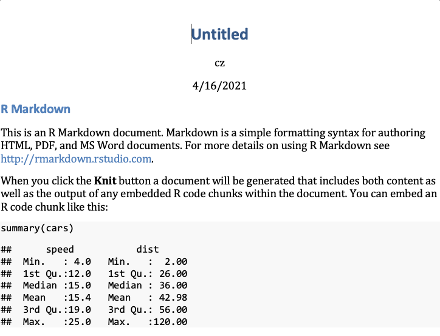
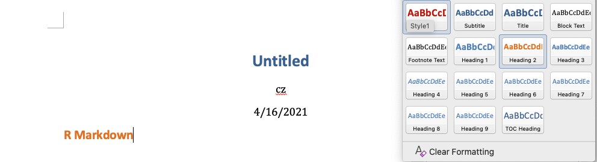

# Autoreport 101

Automated report with Rmarkdown and MS Word, or **autoreport**, is a convenient and reproducible way to create routine reports. Here you will learn how to set up a basic autoreport with figure in `.docx`format. 

For more information you can check the official Rmarkdown documentation.

https://rmarkdown.rstudio.com/articles_docx.html

## Overview

Creating a basic autoreport requires 

- Rstudio, with functional Rmd editor and knit functionality
- MS Word

Briefly, the **style** (e.g. font and text color) of the report is controlled by MS Word, and the **content** of the report is controlled by Rmarkdown. Rmarkdown provides the functionality to dynamically interact with data, computation, table and graph making. 

Here are the 4 steps of creating a basic autoreport: 

1. Create a **style file** in `.docx`
2. Adjust the style to match your need
3. Create a **content file** in `.Rmd`, which uses the `.docx` style file as reference. This is where you write the text content, and interact with data
4. Generate the content file into `.docx` (use Knit)

Repeat step 2-4 as needed. 

# Step 1. Create style file

#### In Rstudio 

1.1 Create an `.Rmd` file with **output: word document**, name it `draft-styles.Rmd`. 

You do not need to change the content of this file, as you will work on the Word document it generates. Alternatively, if you have one style file in `.docx` already, you can skip this step. 

1.2 Knit. This opens a docx with the same name, `draft-styles.docx`. 

It looks like this, which is the default template. If you are happy with how it looks, go to step 3. 

# Step 2. Adjust the style file

#### In MS word

2.1 save a copy of `draft-style.docx`in the same folder, name it `word-style-ref-01.docx`. This is in case you want to go back to default style. 

2.2 edit the **style** manually inside `word-style-ref-01.docx`, using the MS word **Styles panel**. For example, we want to make the Heading 2 in orange. Select the heading, change the text color. 

2.3 We want to make Heading 2 in orange in all the reports we automatically generate, therefore we need to make MS Word remember this setting. **Update the style** by <u>right clicking Update Heading 2 to Match Selection</u>. Other style (e.g. Title) can be updated in the same way.

Now the color for Heading 2 is updated to orange. Save the style file, we try to create a report using this style!

# Step 3. Create content file

#### in Rstudio

3.1 Create a new `.Rmd` file with **output: word document**, name it `test-report.Rmd`

3.2 Write something you wish. You can include a figure as well. We also have a Heading 2 title so that we can experiment the style changes.

3.3 Knit. This opens a docx named `test-report.docx`, check if the texts are proper. For now, the style should match the default (as in step 1)

3.4 In the front matter: specify the style file we modified in step 2, `word-style-ref-01.docx` as the **reference_docx**

# Step 4. Generate content with new style

4.4 Knit again, see if the output is as expected! 

