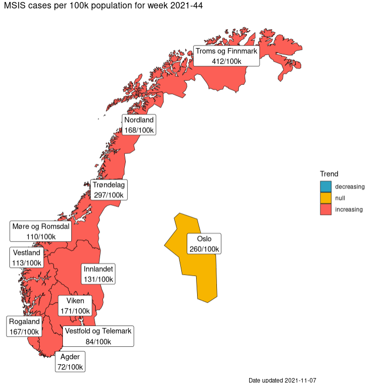

```{r setup, include=FALSE}
knitr::opts_chunk$set(echo = TRUE)
```

# Introduction and disclaimers

This is a demonstration for how to make automated reports with Rmarkdown and MS Word.

The dates, numbers, graphs and tables are for educational purposes only. The text is made to teach R, not to be used in other circumstances.

The data used in this document is aggregated data, and it is public available. 


## This is how we make a report

A report has text. You're reading the text. **Standard markdown style works here as well**.


We insert the figure made before. 




